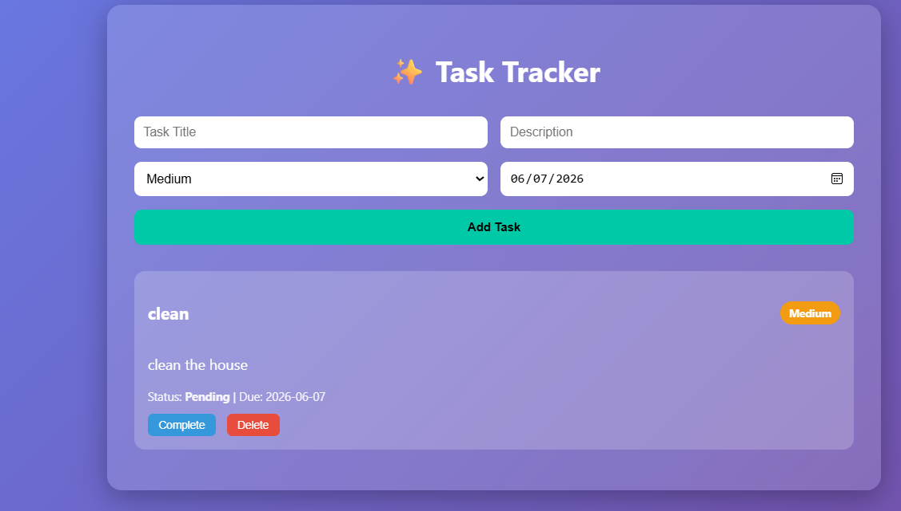
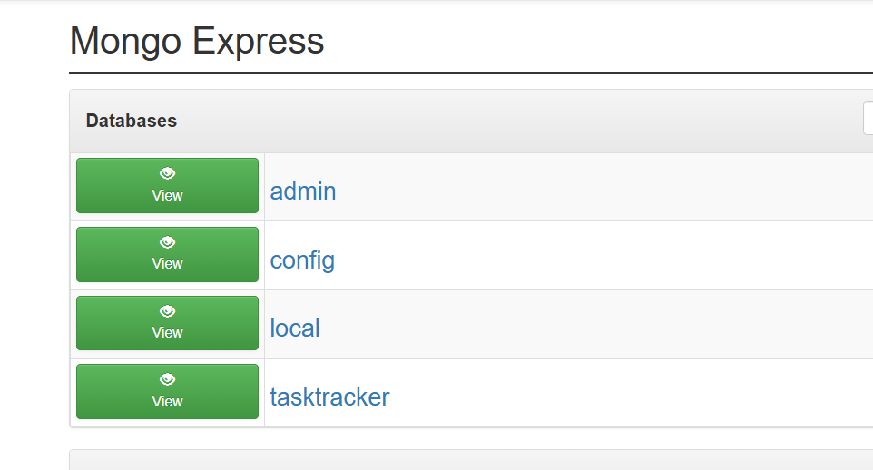
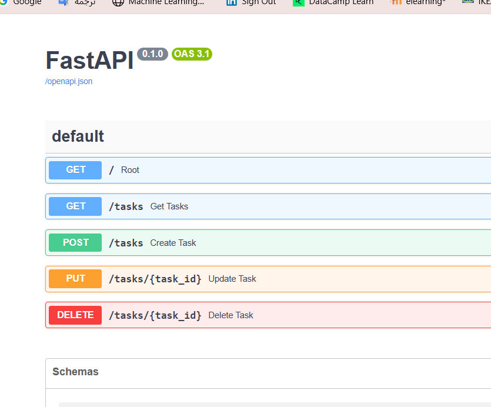

# 🗂 Task Tracker Application

A full-stack Task Tracking system built with:

- **FastAPI** (Backend API)
- **MongoDB** (Database)
- **Docker & Docker Compose**
- **HTML, CSS, JavaScript** (Frontend)

---
## Git use 
`git clone repo` 

`git add .` 

`git commit -m “update”`

`git push origin main`

## Features

- Create, update, delete tasks
- Task priority levels (Low / Medium / High)
- Task status tracking (Pending / Completed)
- Due date management
- MongoDB persistence
- Fully Dockerized architecture

---

## 🖥 User Interface

The frontend is served directly by FastAPI and provides a modern, responsive UI.



**Description:**
- Gradient glassmorphism design
- Priority color badges
- Dynamic task rendering
- Interactive status updates
- Clean and minimal layout

available at:
http://localhost:9000/
---

## 🗄 Database (MongoDB)

The application stores tasks inside MongoDB with persistent Docker volumes.



**Description:**
- Tasks stored in `tasktracker` database
- Collection: `tasks`
- Fields:
  - title
  - description
  - priority
  - status
  - due_date
  - created_at

MongoDB authentication is enabled using environment variables.
available at:
http://localhost:9090/
---

## ⚙ Backend API (FastAPI)

The backend is built using FastAPI and exposes RESTful endpoints.



**Available Endpoints:**

| Method | Endpoint | Description |
|--------|----------|------------|
| GET | `/` | Serves frontend UI |
| GET | `/tasks` | Retrieve all tasks |
| POST | `/tasks` | Create new task |
| PUT | `/tasks/{id}` | Update task |
| DELETE | `/tasks/{id}` | Delete task |

Interactive API documentation is available at:
http://localhost:9000/docs


---

## 🐳 Docker Architecture

The system consists of:

- FastAPI Backend Container
- MongoDB Container
- Mongo Express (Database UI)
- Persistent Volume for Data

Run the project with:

```bash
docker compose up --build
